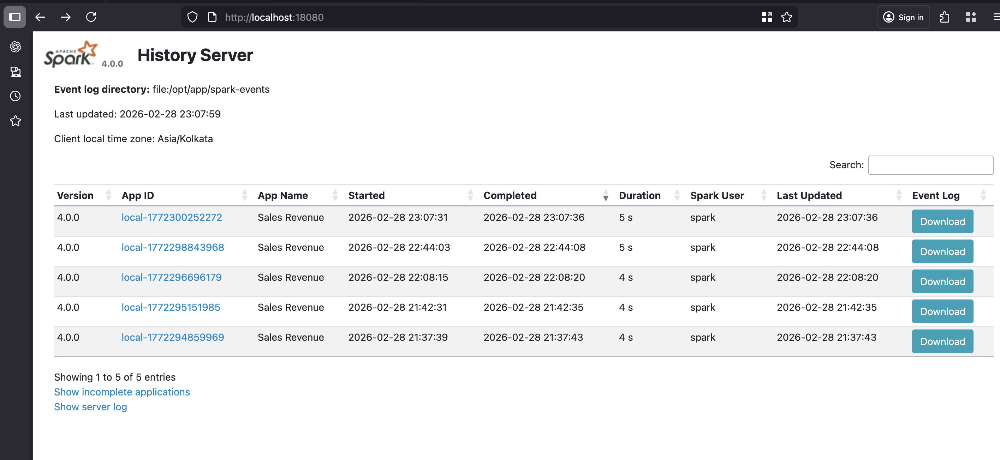

# Running Spark via Docker.

This is a simple sparks setup that shows how to run spark via Docker. The spark script simply reads the input sales csv data ,calculates revenue per country and store results into parquet.

## What we will do is..

1. Generate synthetic sales data
2. Run a spark batch job to calculate revenue metrics
3. Write output in Parquet format
4. Log Spark execution metadata
5. Allow inspection via:
   - Spark UI (live jobs)
   - Spark History Server (completed jobs)

## How to run?

You can run the `jobs/sales_revenue.py` directly via spark-submit if spark is already installed on your device. Alternatively you can run the same via docker by following below steps.

### Running Spark in Docker.

1. Pull Spark 4.x Image
    ```bash
    docker pull apache/spark:4.0.0
    ```
2. Verify spark is installed and check the version.
    ```bash
    ls /opt/spark/bin
    /opt/spark/bin/spark-submit --version
    ```
3. Run Spark Container

    ```bash
    docker run -it \
    -p 4040:4040 \
    -p 18080:18080 \
    -v /Users/<your-user>/Personal/Projects/spark-analytics:/opt/app \
    -w /opt/app \
    apache/spark:4.0.0 \
    bash
    ```
    Replace the path with your actual one in the above command.
    You can then run spark inside the conatiner interactively.

    - What the above command actually does is 
        - Runs Interactively.
        - Port 4040 mapped to Spark UI and 18080 mapped to Spark History UI
        - Mounts your cloned project folder.
        - Sets working directory.
        - Opens a bash shell

4. Launch spark job.

    ```bash
    /opt/spark/bin/spark-submit /opt/app/jobs/sales_revenue.py
    ```
    Additionally you can run with logging enabled.

    ```bash
    /opt/spark/bin/spark-submit \
    --conf spark.eventLog.enabled=true \
    --conf spark.eventLog.dir=file:/opt/app/spark-events \
    jobs/sales_revenue.py
    ```
5. Spark UI.

    Navigate to http://localhost:4040 to view your current spark Job.<br>
    Note the UI is available only till the spark application is running after which its shutdown.

#### Setting up spark history server.

1. Copy the spark-conf/spark-defaults.conf to your $SPARK_HOME/conf path.
If the conf directory doesnt exist, create one and copy.

    ```bash
    mkdir $SPARK_HOME/conf
    cp spark-conf/spark-defaults.conf  $SPARK_HOME/conf
    ```

2. Start the history server.

    ```bash
    /opt/spark/sbin/start-history-server.sh --properties-file spark-conf/spark-defaults.conf
    ```
3. Verify by navigating to http://localhost:18080/ <br>You should be able to see all the history of your spark applications.

